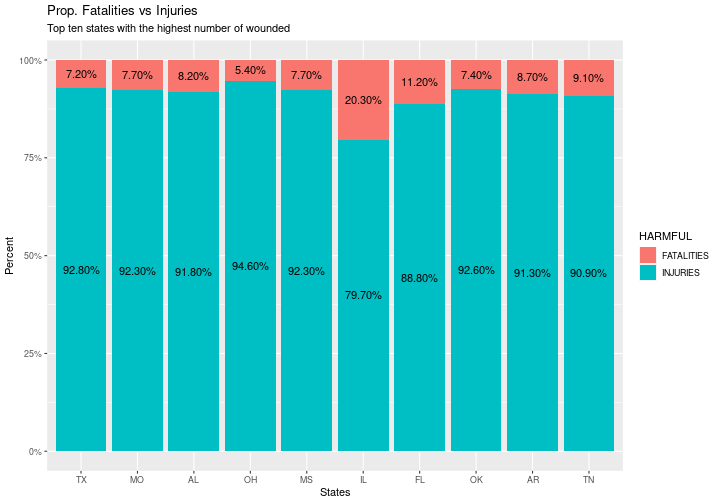
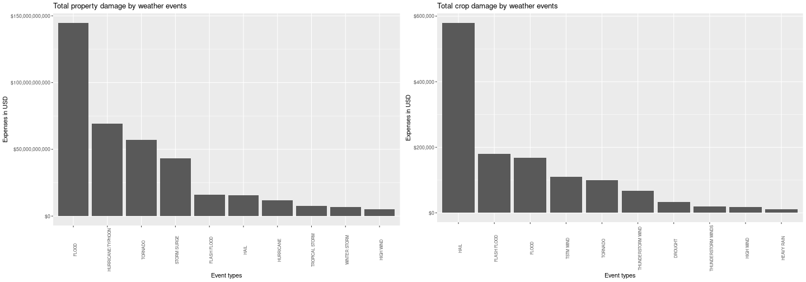

# Problems caused by weather events in the health and economic field in the United States

## Synonpsis
This analysis is intended to explore the database of U.S. National Oceanic and 
Atmospheric Administrations (NOAA), this database tracks characteristics of major storms and weather 
events in the United States from 1950 to 2011, the goal is to see the several damages 
caused in the health and economic of the United States, this report will show summaries 
and different plots related to fatalities, injuries, property and crop damages.

## Libraries


```r
library(data.table)
library(tidyverse)
library(lubridate)
library(cowplot)
```

## Data Processing

This project involves exploring the U.S. National Oceanic and Atmospheric Administration's (NOAA) storm database. This database tracks characteristics of major storms and weather events in the United States, including when and where they occur, as well as estimates of any fatalities, injuries, and property damage.

This project is being done through the Coursera Test Environment, so the data set has already been downloaded to the working directory.


```r
# read data
dt_storm <- fread(file = 'repdata_data_StormData1.csv')

# first six records
head(dt_storm)
```

```
##    STATE__           BGN_DATE BGN_TIME TIME_ZONE COUNTY COUNTYNAME STATE  EVTYPE BGN_RANGE BGN_AZI BGN_LOCATI END_DATE
## 1:       1  4/18/1950 0:00:00     0130       CST     97     MOBILE    AL TORNADO         0                            
## 2:       1  4/18/1950 0:00:00     0145       CST      3    BALDWIN    AL TORNADO         0                            
## 3:       1  2/20/1951 0:00:00     1600       CST     57    FAYETTE    AL TORNADO         0                            
## 4:       1   6/8/1951 0:00:00     0900       CST     89    MADISON    AL TORNADO         0                            
## 5:       1 11/15/1951 0:00:00     1500       CST     43    CULLMAN    AL TORNADO         0                            
## 6:       1 11/15/1951 0:00:00     2000       CST     77 LAUDERDALE    AL TORNADO         0                            
##    END_TIME COUNTY_END COUNTYENDN END_RANGE END_AZI END_LOCATI LENGTH WIDTH F MAG FATALITIES INJURIES PROPDMG PROPDMGEXP
## 1:                   0         NA         0                      14.0   100 3   0          0       15    25.0          K
## 2:                   0         NA         0                       2.0   150 2   0          0        0     2.5          K
## 3:                   0         NA         0                       0.1   123 2   0          0        2    25.0          K
## 4:                   0         NA         0                       0.0   100 2   0          0        2     2.5          K
## 5:                   0         NA         0                       0.0   150 2   0          0        2     2.5          K
## 6:                   0         NA         0                       1.5   177 2   0          0        6     2.5          K
##    CROPDMG CROPDMGEXP WFO STATEOFFIC ZONENAMES LATITUDE LONGITUDE LATITUDE_E LONGITUDE_ REMARKS REFNUM
## 1:       0                                         3040      8812       3051       8806              1
## 2:       0                                         3042      8755          0          0              2
## 3:       0                                         3340      8742          0          0              3
## 4:       0                                         3458      8626          0          0              4
## 5:       0                                         3412      8642          0          0              5
## 6:       0                                         3450      8748          0          0              6
```

```r
# data dimension
dim(dt_storm)
```

```
## [1] 902297     37
```

The events in the database start in the year 1950 and end in November 2011. In the earlier years of the database there are generally fewer events recorded, most likely due to a lack of good records. More recent years should be considered more complete.

## Results

This analysis aims to try to answer the following questions:

### 1. Across the United States, which types of events (as indicated in the EVTYPE variable) are most harmful with respect to population health?

We began to explore what types of events are most harmful with respect to the health of the population, for this we observe which are the ten events with the highest number of injuries and fatalities.


```r
# summary of top ten events with the most injuries and fatalities
vars <- c('FATALITIES', 'INJURIES')

lapply(X = vars, 
       function(x){
         dt_storm[
           , lapply(.SD, sum), 
           .SDcols = x, 
           by = EVTYPE
           ][
             order(-get(x))
             ][
               1:10
             ]
       }) -> top_health_event

top_health_event
```

```
## [[1]]
##             EVTYPE FATALITIES
##  1:        TORNADO       5633
##  2: EXCESSIVE HEAT       1903
##  3:    FLASH FLOOD        978
##  4:           HEAT        937
##  5:      LIGHTNING        816
##  6:      TSTM WIND        504
##  7:          FLOOD        470
##  8:    RIP CURRENT        368
##  9:      HIGH WIND        248
## 10:      AVALANCHE        224
## 
## [[2]]
##                EVTYPE INJURIES
##  1:           TORNADO    91346
##  2:         TSTM WIND     6957
##  3:             FLOOD     6789
##  4:    EXCESSIVE HEAT     6525
##  5:         LIGHTNING     5230
##  6:              HEAT     2100
##  7:         ICE STORM     1975
##  8:       FLASH FLOOD     1777
##  9: THUNDERSTORM WIND     1488
## 10:              HAIL     1361
```

We check which states have the most injuries and fatalities, for this we obtain the top ten of states with the highest number of injuries and fatalities due to weather events.


```r
# top ten states with the most injuries and fatalities due to weather events
lapply(
  X = vars, 
  function(x){
    tapply(
      X = dt_storm[, get(x)], 
      INDEX = dt_storm[, STATE], 
      FUN = sum
      ) %>% 
      sort(decreasing = T) %>% 
      head(10)
    }) -> top_health_state

names(top_health_state) <- vars

top_health_state
```

```
## $FATALITIES
##   IL   TX   PA   AL   MO   FL   MS   CA   AR   TN 
## 1421 1366  846  784  754  746  555  550  530  521 
## 
## $INJURIES
##    TX    MO    AL    OH    MS    FL    OK    IL    AR    TN 
## 17667  8998  8742  7112  6675  5918  5710  5563  5550  5202
```

To finish with the first part of the analysis, let's see the ten states with the highest number of wounded and how many weather events have occurred in these states from 1950 to 2011.

To do this we proceed to obtain the ten states with the highest number of wounded by injuries and fatalities.


```r
# top ten most wounded by injuries and fatalities due to weather events by states
dt_storm[
  , lapply(.SD, FUN = sum), 
  .SDcols = vars, 
  by = STATE
  ][
    , TOTAL_WOUNDED := FATALITIES + INJURIES
    ][
      order(-TOTAL_WOUNDED)
    ][
      1:10
    ] -> dt_health_state
```

We then get the total weather events for each state.


```r
# total events for each state
dt_storm[ 
         , .N, 
         by = .(EVTYPE, STATE)
         ][
           , lapply(.SD, sum),
           .SDcols = 'N',
           by = STATE
           ][
             order(-N)
             ][
               , .(STATE, TOTAL_EVENTS = N)
             ] -> dt_event_state
```

So we merge both data sets and get the summary of the top ten states with the most wounded and number of events per state.


```r
# summary of the ten states with most wounded and number of events by state
merge.data.table(
  x = dt_health_state,
  y = dt_event_state, 
  by = 'STATE', 
  all.x = T,
  sort = F
    ) -> dt_sum_state
dt_sum_state
```

```
##     STATE FATALITIES INJURIES TOTAL_WOUNDED TOTAL_EVENTS
##  1:    TX       1366    17667         19033        83728
##  2:    MO        754     8998          9752        35648
##  3:    AL        784     8742          9526        22739
##  4:    OH        403     7112          7515        24922
##  5:    MS        555     6675          7230        22192
##  6:    IL       1421     5563          6984        28488
##  7:    FL        746     5918          6664        22124
##  8:    OK        458     5710          6168        46802
##  9:    AR        530     5550          6080        27102
## 10:    TN        521     5202          5723        21721
```

In the summary table we can see the total number of wounded in absolute values, however to see the percentage of fatalities and injuries over the total number of wounded, a bar plot segmented by relative frequency can be useful.


```r
melt.data.table(
  data = dt_sum_state, 
  id.vars = c('STATE', 'TOTAL_EVENTS', 'TOTAL_WOUNDED'), 
  variable.name = 'HARMFUL')[
    , `:=` (STATE = factor(STATE, levels = dt_sum_state$STATE),
            prop = {tmp <- value / TOTAL_WOUNDED
                    round(tmp, 3)})
    ] -> dt_melt

ggplot(data = dt_melt, aes(x = STATE, y = value, fill = HARMFUL)) + 
  geom_col( position = 'fill' ) + 
  geom_text( aes(label = scales::percent(prop)), 
             position = position_fill(vjust = .5) ) + 
  scale_y_continuous(labels = scales::percent) + 
  labs(title = 'Prop. Fatalities vs Injuries',
       subtitle = 'Top ten states with the highest number of wounded', 
       x = 'States',
       y = 'Percent')
```



### 2. Across the United States, which types of events have the greatest economic consequences?
To try to answer this question, first we proceed to obtain the amounts of expenses caused by weather events.


```r
# levels of interest in the variables PROPDMGEXP and CROPDMGEXP
pattern <- '[a-zA-Z]'

# function that associates the levels of the variables PROPDMGEXP and CROPDMGEXP
base <- function(x){
  ifelse(x == 'B',
         10**9, 
         ifelse(x == 'M',
                10**6, 
                ifelse(x == 'K',
                       10**3, 
                       ifelse(x == 'H',
                              10**2, 1
                              )
                       )
                )
         )
  }
```

We proceed to create the variables `FIGURES_PRO` and `FIGURES_CRO` that contain the expenses caused by weather events to properties and crops.

Next we are going to obtain the top ten of weather events that have caused the most damage in terms of expenses incurred in the property and crops from 1950 to 2011.


```r
# creation of variables FIGURES_PRO and FIGURES_CRO
dt_storm[
  grepl(pattern = pattern, x = PROPDMGEXP) | grepl(pattern = pattern, x = CROPDMGEXP)
  ][
    ,`:=` (FIGURES_PRO = {tmp <- toupper(PROPDMGEXP);
                          tmp2 <- base(x = tmp);
                          tmp2 * PROPDMG},
           FIGURES_CRO = {tmp <- toupper(CROPDMGEXP);
                          tmp2 <- base(x = tmp2);
                          tmp2 * CROPDMG}
           )
    ] -> dt_storm2

fig_vars <- c('FIGURES_PRO','FIGURES_CRO')

lapply(
  X = fig_vars,
  function(x){
    dt_storm2[
      , lapply(.SD, sum), by = EVTYPE, .SDcols = x
      ][
        order(-get(x))
        ][
          1:10
        ]
  }) -> economic_con

economic_con
```

```
## [[1]]
##                EVTYPE  FIGURES_PRO
##  1:             FLOOD 144657709800
##  2: HURRICANE/TYPHOON  69305840000
##  3:           TORNADO  56937160533
##  4:       STORM SURGE  43323536000
##  5:       FLASH FLOOD  16140811638
##  6:              HAIL  15732267253
##  7:         HURRICANE  11868319010
##  8:    TROPICAL STORM   7703890550
##  9:      WINTER STORM   6688497250
## 10:         HIGH WIND   5270046260
## 
## [[2]]
##                 EVTYPE FIGURES_CRO
##  1:               HAIL   579576.28
##  2:        FLASH FLOOD   179200.46
##  3:              FLOOD   168037.88
##  4:          TSTM WIND   109202.60
##  5:            TORNADO   100018.52
##  6:  THUNDERSTORM WIND    66791.45
##  7:            DROUGHT    33898.62
##  8: THUNDERSTORM WINDS    18684.93
##  9:          HIGH WIND    17283.21
## 10:         HEAVY RAIN    11122.80
```

Sometimes it is a good idea to visualize summaries and any other result through plots, it can be clearer than summary data sets.


```r
title <- c('Total property damage by weather events',
           'Total crop damage by weather events')

mapply(
  function(x,y,z){
    x[, EVTYPE := fct_inorder(EVTYPE)] %>% 
      ggplot(aes(x = EVTYPE, y = get(y))) + 
      geom_col() + 
      scale_y_continuous(labels = scales::dollar) +
      labs(title = z, x = 'Event types', y = 'Expenses in USD') + 
      theme(axis.text.x = element_text(angle = 90, size = 7))
    },
  economic_con, fig_vars, title, SIMPLIFY = F
  ) -> plots

names(plots) <- c('p1', 'p2')

plot_grid(plots$p1, plots$p2)
```



**Project link on** [github](https://github.com/josecoello21/Reproducible_Research_Project.git)<base target="_top"/>
